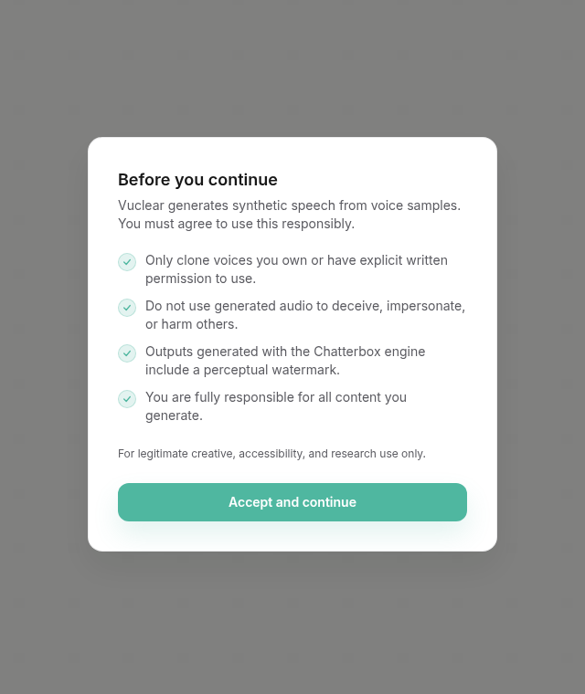

# Vuclear

Local-first voice cloning and narration for creators who want usable audio without handing the work to a cloud service.

## Preview



Vuclear lets you:
- create voice profiles from consented reference audio
- generate narration from text
- apply lightweight effects presets
- manage long-form scripts with chunking and crossfade
- keep outputs, jobs, and profiles on disk locally

## Production posture

This repository is designed to run locally or in a self-hosted environment.

Key points:
- Data is stored under DATA_DIR, defaulting to ./data
- The backend exposes a FastAPI HTTP API
- The frontend is a Next.js app
- The system supports multiple local TTS engines
- Consent is required before creating a voice profile
- F5-TTS is non-commercial only

## Stack

- Backend: Python 3.11–3.13, FastAPI, Uvicorn
- Frontend: Next.js, React, SWR
- Storage: local filesystem, JSON metadata, WAV/MP3 artifacts
- Audio tooling: ffmpeg, ffprobe, librosa, soundfile, pyloudnorm

## Features

Current production features:
- voice profile creation from upload or recording
- reference audio validation and preprocessing
- job queue with persisted job state
- synthesis output download in WAV or MP3
- audio effects presets: dry, warm, broadcast, telephone, cinematic
- long-form splitting with sentence-aware chunking and crossfade
- profile sample tracking
- generation lineage and takes

## Repository layout

- backend/ — FastAPI app, services, routers, CLI
- frontend/ — Next.js UI
- tests/ — automated tests and evaluation helpers
- docs/ — service contracts and upgrade notes
- data/ — runtime storage created at launch

## Requirements

Install these before running locally or in Docker:
- Python 3.11–3.13
- Node.js 20+
- ffmpeg
- ffprobe

Recommended for local development:
- Python virtual environment
- one supported voice engine installed locally

Supported engines:
- chatterbox — default, commercial use OK
- metavoice — commercial use OK, heavier GPU requirement
- f5_noncommercial — non-commercial only

## Quick start

1. Clone the repo

```bash
git clone https://github.com/asimons81/vuclear.git
cd vuclear
```

2. Configure environment

```bash
cp .env.example .env
```

3. Create a Python virtual environment

```bash
python3 -m venv .venv
source .venv/bin/activate
pip install -r backend/requirements.txt
```

4. Install the frontend dependencies

```bash
cd frontend
npm install
cd ..
```

5. Install one TTS engine

```bash
pip install chatterbox-tts
# or: pip install metavoice
# or: pip install f5-tts   # non-commercial only
```

6. Start the app

```bash
./start.sh
```

Open:
- http://localhost:3000
- http://localhost:3000/studio
- http://localhost:8000/docs

## Environment variables

Copy .env.example to .env and adjust as needed.

| Variable | Default | Purpose |
| --- | --- | --- |
| VOICE_ENGINE | chatterbox | Selects the local voice engine |
| DATA_DIR | ./data | Local storage root for profiles, jobs, outputs, logs, tmp |
| DENOISE | false | Enables DeepFilterNet preprocessing if installed |
| HOST | 0.0.0.0 | Backend host |
| PORT | 8000 | Backend port |
| CORS_ORIGINS | http://localhost:3000 | Allowed frontend origins |
| RATE_LIMIT_VOICE_UPLOAD | 10/hour | Voice upload rate limit |
| RATE_LIMIT_SYNTHESIZE | 20/hour | Synthesis rate limit |
| LOG_LEVEL | INFO | Backend logging level |

## Storage layout

Runtime data is written under DATA_DIR:

- voices/ — voice profiles and reference audio
- jobs/ — job state JSON files
- outputs/ — generated audio and metadata
- logs/ — service logs and audit log
- tmp/ — temporary working files

## API

Primary endpoints:

- POST /api/v1/voices — create a voice profile
- GET /api/v1/voices — list profiles
- POST /api/v1/voices/{voice_id}/samples — add an additional sample
- DELETE /api/v1/voices/{voice_id} — delete a profile
- POST /api/v1/synthesize — queue a synthesis job
- GET /api/v1/jobs/{job_id} — poll a job
- GET /api/v1/outputs — list outputs
- GET /api/v1/outputs/takes/{generation_id} — list takes for a generation
- GET /api/v1/outputs/{output_id}/download?format=wav|mp3 — download audio
- GET /api/v1/health — health/readiness

## Synthesis controls

The Studio supports:
- speed
- sentence pause
- chunk size
- crossfade duration
- effects preset

Effects presets:
- dry
- warm
- broadcast
- telephone
- cinematic

## Docker

Build and run with Docker Compose:

```bash
docker compose up --build
```

Notes:
- backend binds to port 8000
- frontend binds to port 3000
- data persists in the local ./data directory
- GPU reservations are configured in docker-compose.yml for supported NVIDIA setups

## Production notes

If you are deploying this for real use:
- set a persistent DATA_DIR on durable storage
- use a real reverse proxy in front of the frontend and backend
- restrict CORS_ORIGINS to the exact frontend origin(s)
- confirm the selected engine license before using commercially
- keep ffmpeg and ffprobe installed on the host/container image
- back up DATA_DIR regularly
- do not use f5_noncommercial in paid or commercial deployments

## Development

Run the automated checks:

```bash
./start.sh --check-only
```

Run backend tests directly:

```bash
source .venv/bin/activate
pytest -q
```

If you need to inspect the API schema, use:

```bash
uvicorn backend.main:app --reload --port 8000
```

## Troubleshooting

### Backend will not start
- confirm Python 3.11–3.13 is installed
- confirm ffmpeg and ffprobe are in PATH
- confirm a supported engine is installed
- check the service log under data/logs/service.log

### Frontend will not start
- confirm Node.js 20+ is installed
- run npm install in frontend/
- ensure NEXT_PUBLIC_API_URL points to the backend if you are not using localhost

### Voice upload fails
- the reference sample must be consented
- uploads must be WAV, MP3, OGG, WebM, M4A, or FLAC
- the sample must be between 5 and 120 seconds

### Synthesis fails
- confirm the selected voice profile has a reference WAV
- confirm the chosen engine is installed
- check the job error and backend logs

## License

MIT

## Approval

This README draft is ready for review. If approved, I will replace README.md with this production-ready version.